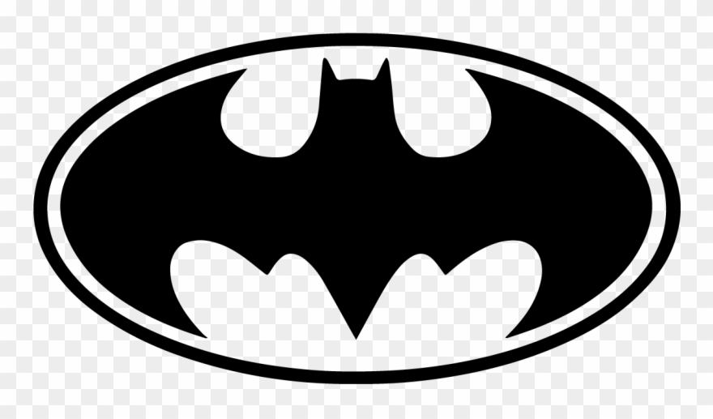
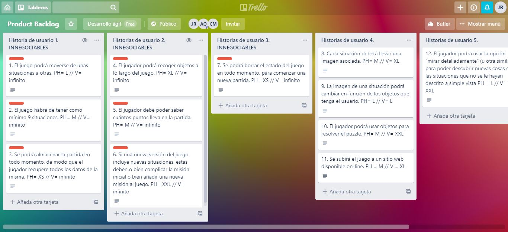

# ProjectPolybius

## Descripción de la trama ##



La aventura gráfica nos pondrá en la piel de batman tras un ataque a la batcueva. Deberemos averiguar quién está detrás del ataque, arreglar nuestro batmóvil y buscar en los escenarios a los que nos dirijan las pistas que nos vamos encontrando para resolver el misterio.

El juego se apoyará en imágenes y escenas emblemáticas de los escenarios que vayamos visitando. En cada escenario habrá que resolver un puzzle interactuando con el entorno. Podremos usar los diferentes gadgets del personaje y su emblemático vehículo.

Por razones obvias no podemos decir quién o quienes son lo villanos. La historia se irá perfilando conforme se vaya avanzando en los diferentes sprints.

## Enlace a Trello ##

Enlace al tablero de trello: https://trello.com/b/feNAv2oH

## ProductBacklog ##





