# ProjectPolybius

## Descripción de la trama ##



La aventura gráfica nos pondrá en la piel de batman tras un ataque a la batcueva. Deberemos averiguar quién está detrás del ataque, arreglar nuestro batmóvil y buscar en los escenarios a los que nos dirijan las pistas que nos vamos encontrando para resolver el misterio.

El juego se apoyará en imágenes y escenas emblemáticas de los escenarios que vayamos visitando. En cada escenario habrá que resolver un puzzle interactuando con el entorno. Podremos usar los diferentes gadgets del personaje y su emblemático vehículo.

Por razones obvias no podemos decir quién o quienes son lo villanos. La historia se irá perfilando conforme se vaya avanzando en los diferentes sprints.

## Enlace a Trello ##

Enlace al tablero de trello: https://trello.com/b/feNAv2oH

## Product Backlog ##

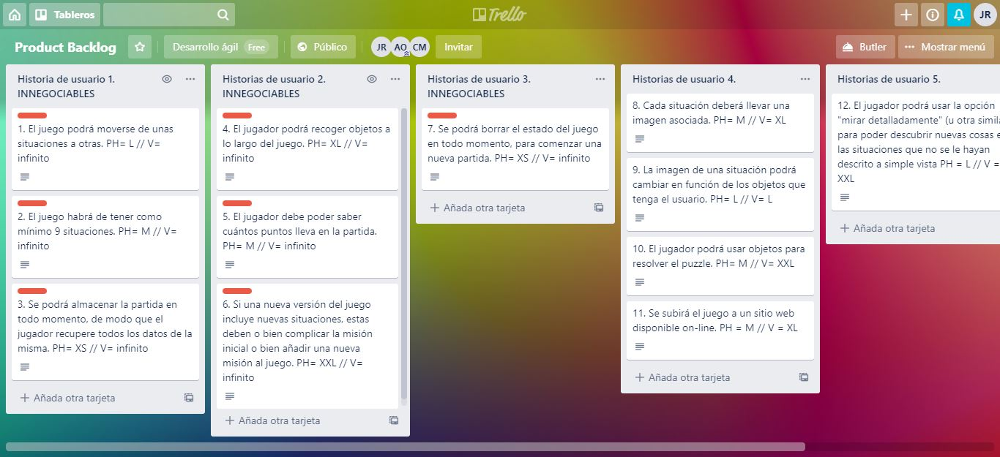


---

# DIARIO DE DESARROLLO - SPRINT 1

**El Product Owner para este sprint es Jesús García Rodríguez**

Este es el trabajo que hemos llevado a cabo durante el primer sprint de la práctica:

- Como historia de usuario hemos elegido la número 2 (el juego habrá de tener como mínimo 9 situaciones), ya que consideramos que sería la base de toda la práctica sobre la que podremos desarrollar las restantes historias de usuario. Por tanto, considerando todo el trabajo que lleva implícito el desarrollo de la misma, no hemos tratado ninguna otra historia para este sprint.

	Para repartir el trabajo entre los distintos componentes del grupo de trabajo, hemos dividido la historia de usuario en diferentes subtareas, reflejadas en el siguiente tablero de Trello:

#### Sprint Backlog

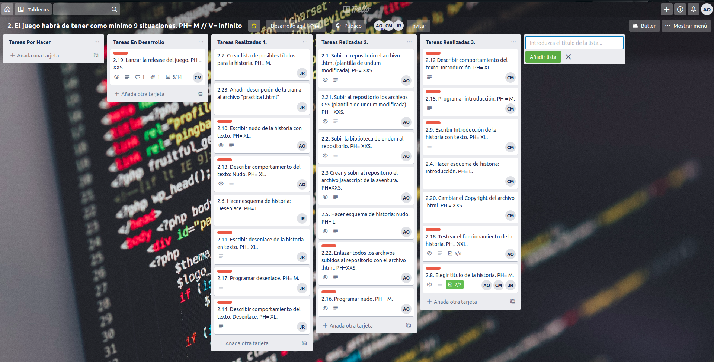

_Nota: En el guión de la práctica se nos pedía que incluyésemos una captura de pantalla para mostrar las historias de usuario que hemos escogido y tantas capturas capturas de pantalla como fuese necesario para mostrar las subtareas de las mismas. Como sólo hemos trabajado sobre una única historia de usuario, y en la captura de pantalla se recogen todas las subtareas en la que la hemos dividido, sólo vamos a incluir esa única captura._

- Tras el Product Backlog Refinement, únicamente hemos modificado el Product Backlog desarrollado en la práctica anterior, y quedaría así:

#### Product Backlog

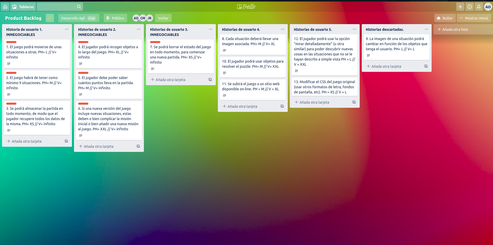

De este tablero, hemos hecho las siguientes modificaciones: hemos añadido el requisito 13 (modificar el CSS del juego original), y descartado el 9 (la imagen de una situación podrá cambiar en función de los objetos que tenga el usuario).

El enlace a dicho tablero es el siguiente: https://trello.com/b/6AUpPdV9/2-el-juego-habr%C3%A1-de-tener-como-m%C3%ADnimo-9-situaciones-ph-m-v-infinito

#### Sprint Review

- Como primer apunte, hemos de decir que todas las tareas han sido realizadas en el plazo concretado.
- En general, todo ha ido bien sin ninguna complicación mayor. Únicamente, hemos considerado que las tareas relacionadas con el comportamiento de la historia no han sido necesarias. Además, hemos tenido algunas complicaciones a la hora de programar la historia, debido a que no estamos aún muy familiarizados con el uso de Undum, pero entre todos hemos podido subsanar los pequeños problemas.
- El equipo ha llegado al consenso de que lo siguiente que se debería hacer es implementar tanto el sistema de guardado y borrado de partida como el sistema de inventario (recogida y uso de objetos). El sistema de guardado y borrado se corresponde con las historias de usuario 3 y 7, y el sistema de inventario estaría definido por la 4.
- Las siguientes historias de usuario con valor infinito son: 1, 3, 4, 5, 6 y 7.

#### Sprint Retrospective

No hemos incluido la Sprint Retrospective porque no lo hemos tenido claro.

---

# DIARIO DE DESARROLLO - SPRINT 2

**El product owner para este sprint es Cristian Muñoz Partido**

### Sprint Planning

Resultado Sprint Planning:

- Como primera historia de usuario elegimos la número 4 porque nos parecía que era la siguiente historia de usuario que más valor aportaba a la jugabilidad, además en ese momento era la historia de usuario que más capacitados nos veíamos para hacer.

- Como segundas historias de usuario elegimos la número 3 y la número 7 ya que eran las que menor valor de puntos de historia tenían.

A continuación descompusimos en tareas las historias de usuario elegidas que dieron como resultado el siguiente SprintBacklog:

_Nota:  Para elegir los puntos de historia de cada tarea utilizamos Póker Planner en la plataforma Slack._


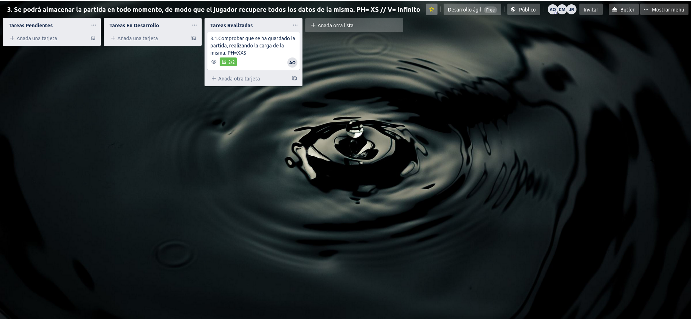
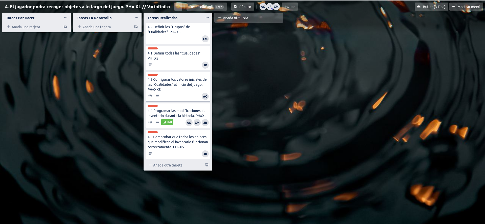
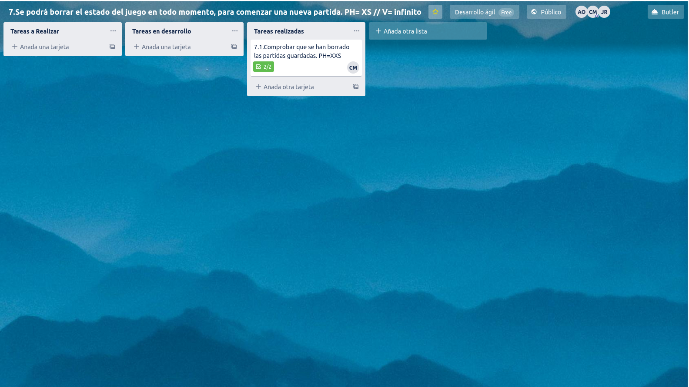

### ProductBacklog Refinement

El 30 de Marzo realizamos ProductBacklog Refinement dado que el día anterior terminamos las últimas tareas que definimos en el sprint planning.

Resultado de la reunión:

Cuando hicimos esta reunión la fecha de entrega era el 3 de Abril (lo que nos daba 4 días de margen para trabajar). Por este motivo nos centramos en elegir historias de usuario que nos diesen tiempo a terminarlas para esa fecha.

Las historias de usuario que decidimos añadir al sprint fueron las siguientes:

- Historia de usuario 8.

- Historia de usuario 13.

Decidimos que Andrés se encargase solo de la historia de Usuario número 13 ya que tenia más experiencia trabajando con css lo que le permitiría tener terminada la historia de usuario para la fecha de entrega. A su vez Jesús y yo(Cristian) nos encargaríamos de hacer la historia de usuario número 8 para tenerla lista a tiempo.

Tras la reunión el SprintBacklog se vio modificado añadiéndose las siguientes tareas:

_Nota:  Para elegir los puntos de historia de cada tarea utilizamos Póker Planner en la plataforma Slack._

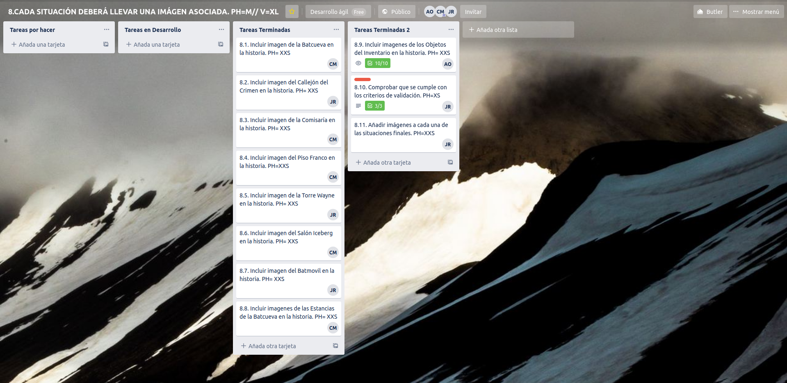
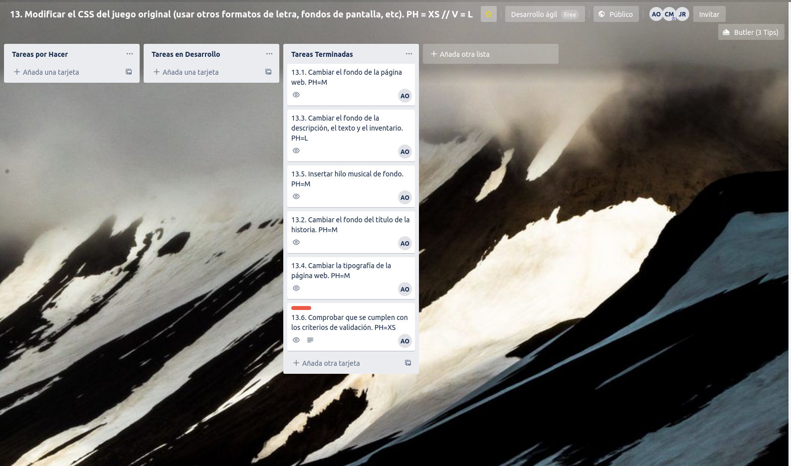

Estado del ProductBacklog tras finalizar la reunión:

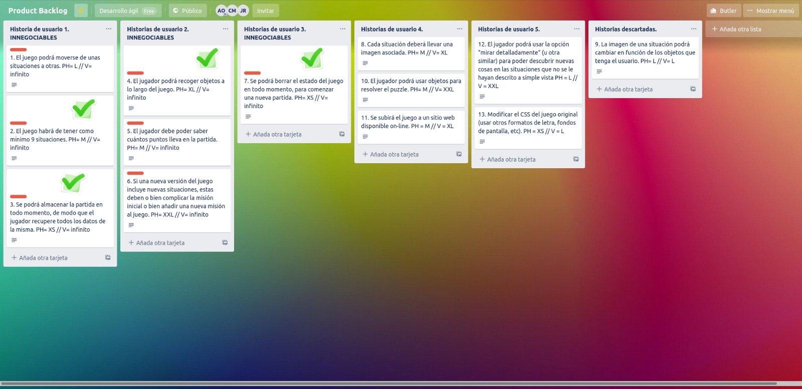

## Sprint Review

Se han realizado todas las tareas del SprintBacklog.








### Estimación del ProductBacklog

Tras revisar el product backlog estimamos que nos dará tiempo a realizar las historias de usuario restantes.

La idea principal del grupo es realizar las historias de usuario 5 y 6 en la primera semana y el resto de historias de usuario restantes en la última semana.

### Problemas

Dada la situación de alerta sanitaria hemos tenido que dedicarle más tiempo a otras asignaturas y no hemos podido hacer todas las daily scrum que nos hubiese gustado, además ha afectado a nuestro rendimiento en el proyecto.

Para solucionar esto último decidimos trabajar durante Semana Santa para recuperar los días perdidos.

Además decidimos que si algún miembro de disponía de más tiempo iría avanzando las tareas restantes aunque esas tareas perteneciesen a otro miembro, avisando previamente.

He estado unos días indispuesto para poder continuar con el proyecto, ya que me han ingresado debido a una gastroenteritis aguda y mis compañeros se han repartido las tareas que me correspondían para poder acabar con el proyecto a tiempo.

La solución al problema que hemos tenido con las daily scrum lo trataremos en un apartado posterior.

Personalmente desarrollando las tareas que me correspondían en la historia de usuario 8, tuve un problema para incluir las imágenes, ya que no conseguía que apareciesen en la historia. Pregunté a Andrés, ya que tenía mas experiencia en este campo y el problema fue solucionado ya que era un error de código.


## Sprint Retrospective

_Nota: Ya que en el sprint anterior no realizamos el Sprint Retrospective vamos a añadir el del Sprint anterior._

En un principio decidimos realizar las reuniones y daily scrum por Slack, pero no permitía las llamadas de más de dos personas sin un perfil de pago, además el número de mensajes está limitado a 10000.

A raíz de este problema decidimos trabajar con **Skype** para hacer llamadas grupales y realizar todas las reuniones. A día de hoy utilizamos esta herramienta.

Para comunicarnos día a día usamos **WhatsApp** y a través de este medio concertamos las reuniones, daily scrums e informamos de algún posible problema puntual al resto del grupo.

Usamos **Slack** para recibir notificaciones de los commits y usar póker planner.

Consideramos que no es necesario realizar alguna mejora en nuestro método de trabajo. 

## Daily Scrum

Una nueva idea con respecto al sprint anterior, ha sido transcribir las daily scrum de cada día por el chat de Skype.

A la semana hemos hecho entre 3 y 4 daily scrum consecuencia del problema que hemos anunciado antes.

Para solventar este problema, si algún día no podíamos hacer daily scrum, al día siguiente escribíamos y comentábamos lo realizado el día anterior.


---
# DIARIO DE DESARROLLO - SPRINT 3

**Product Owner: Andrés Rojas Ortega.**

## Sprint Planning

Realizamos la reunión el día 14 de abril. Para este Sprint hemos decidido abordar las siguientes historias de usuario:

- Historia de usuario 5: El jugador debe poder saber cuántos puntos lleva en la partida. Hemos decidido realizar esta historia de usuario dado que lo vamos a implementar con una cualidad que sea una barra de progreso, y ya tenemos experiencia al haber realizado la historia de usuario número 4.

- Historia de usuario número 6: Si una nueva versión del juego incluye nuevas situaciones, estas deben o bien complicar la misión o bien añadir una nueva misión al juego. Hemos decidido incluir esta historia de usuario porque vamos a tener que incluir nuevas situaciones a la historia para poder mostrar una situación u otra dependiendo de si es la primera vez que visitamos una parte en concreto del juego. 

- Historia de usuario 10: El jugador podrá usar objetos para resolver el puzzle. Hemos decidido realizar esta historia de usuario porque en el sprint anterior implementamos el sistema de inventario pero no podíamos interactuar con el escenario utilizando estos objetos. Esta historia le añadirá al producto un valor considerable. Además, hemos llegado al acuerdo de que esta historia de usuario está intrínsecamente relacionada con la historia de usuario 6 dado que vamos a complicar el avance del jugador dependiendo de los objetos que posea y, además, para poder implementar el sistema de puzzles tendremos que crear situaciones nuevas que hagan la función de "nodos de decisión".

En el caso de nuestro grupo, la última vez que analizamos los requerimientos del cliente y las historias de usuario del Product Backlog no se había añadido el requerimiento **"El juego debe ser 100% responsive design (tal como lo hace Undum es 99% solamente y algunas veces no se ven bien las pantallas en dispositivos móviles)"**. Es por este motivo que pasamos a evaluarla en este Sprint Planning.

Tras deliverar, llegamos a la conclusión de que no vamos a incluir este requerimiento en el Product Backlog. Esta decisión se vió motivada principalmente por dos motivos:

- No tenemos el conocimiento necesario para poder lograr el objetivo de este requerimiento. El tiempo que empleáramos en la búsqueda de información, y el tiempo empleado en el ensayo y error hasta alcanzar un resultado aceptable perjudicaría gravemente a los tiempos que estamos manejando en la realización del proyecto.

- El hecho de que aún tenemos Historias de Usuario innegociables sin realizar. Tenemos que centrarnos en la implementación de estas historias de usuario.

Para finalizar, nos hemos propuesto tener terminadas todas las tareas para el día 19 de marzo y así poder realizar la Product Backlog Refinement ese mismo día. En la Product Backlog Refinement organizaremos las historias de usuario restantes para la recta final del proyecto.

A continuación, mostramos el Sprint Backlog en el que hemos descompuesto las historias de usuario elegidas:

_Nota: Para asignar los puntos de historia a las tareas en las que hemos descompuesto las historias de usuario hemos utilizado la aplicación Poker Planner de la plataforma Slack._

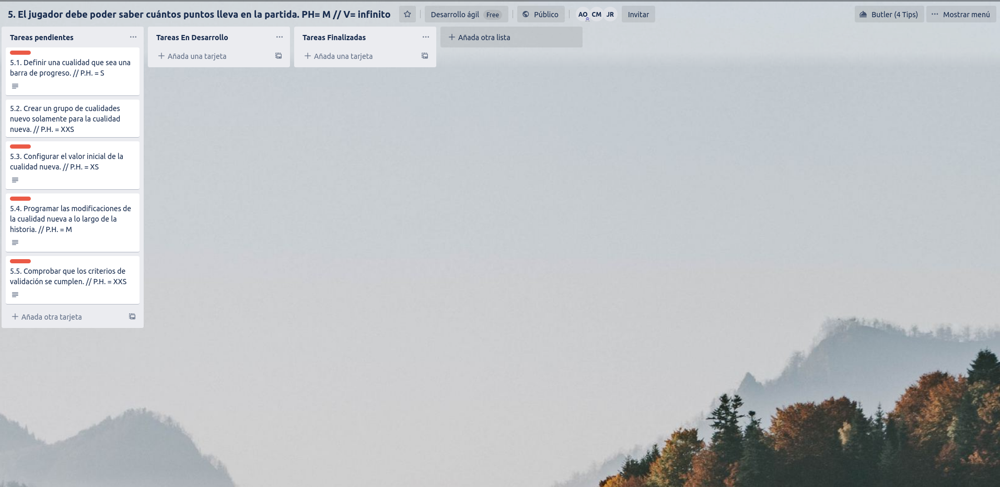

Enlace al tablero en trello: https://trello.com/b/4xKIoq9U/5-el-jugador-debe-poder-saber-cu%C3%A1ntos-puntos-lleva-en-la-partida-ph-m-v-infinito

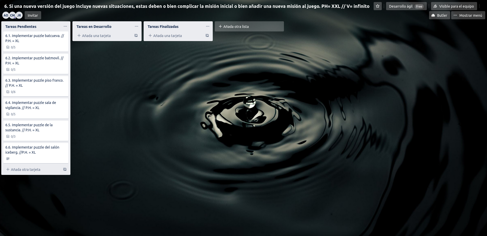

Enlace al tablero en trello: https://trello.com/b/XLuLl4TM/6-si-una-nueva-versi%C3%B3n-del-juego-incluye-nuevas-situaciones-estas-deben-o-bien-complicar-la-misi%C3%B3n-inicial-o-bien-a%C3%B1adir-una-nue

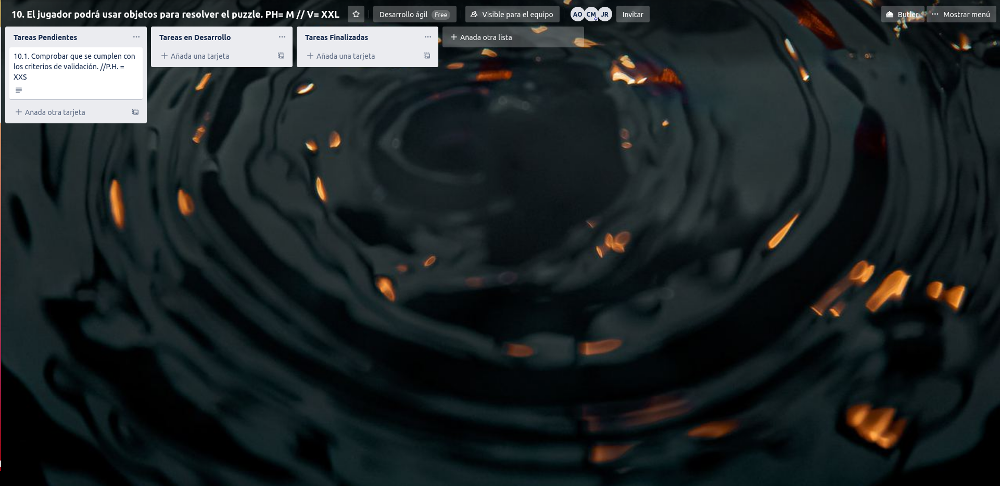

Enlace al tablero en trello: https://trello.com/b/cfin4peA/10-el-jugador-podr%C3%A1-usar-objetos-para-resolver-el-puzzle-ph-m-v-xxl

## Product Backlog Refinement

Esta reunión se realizó el día 20 de abril. En ella se obtuvieron los resultados que se presentan a continuación:

### Estado del Sprint Backlog

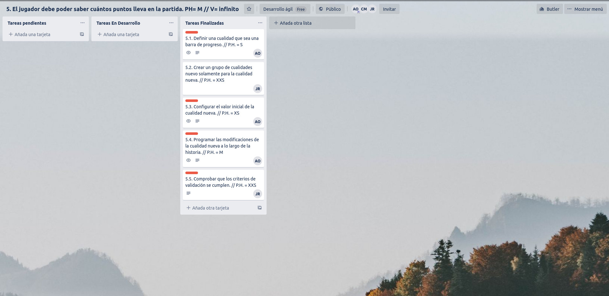

Enlace al tablero en trello: https://trello.com/b/4xKIoq9U/5-el-jugador-debe-poder-saber-cu%C3%A1ntos-puntos-lleva-en-la-partida-ph-m-v-infinito

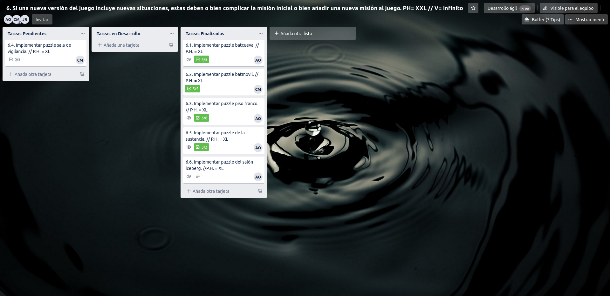

Enlace al tablero en trello: https://trello.com/b/XLuLl4TM/6-si-una-nueva-versi%C3%B3n-del-juego-incluye-nuevas-situaciones-estas-deben-o-bien-complicar-la-misi%C3%B3n-inicial-o-bien-a%C3%B1adir-una-nue

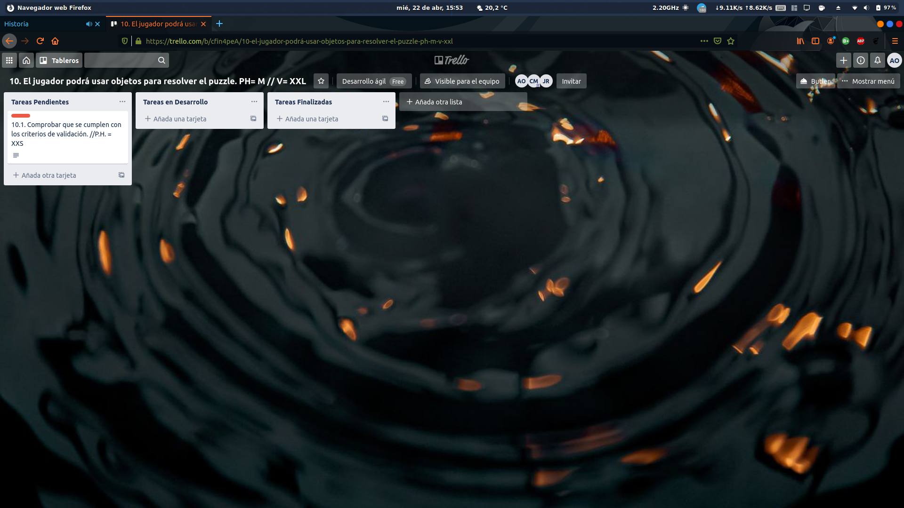

Enlace al tablero en trello: https://trello.com/b/cfin4peA/10-el-jugador-podr%C3%A1-usar-objetos-para-resolver-el-puzzle-ph-m-v-xxl

### Detalles y estimaciones

Dado que la historia de usuario 10 estará completa cuando se termine la historia de usuario 6 a falta de comprobar que se validen los criterios de validación, y que según nuestras previsiones la historia de usuario número 6 estará terminada en breve, hemos decidido incluir dos nuevas historias de usuario al Sprint Backlog:

- La historia de usuario número 1. (Ya que esta historia se ha realizado indirectamente tras completar historias de usuario anteriores).
- La historia de usuario número 12.

Dado el tiempo restante y las tareas restantes que nos quedan por hacer, hemos decidido eliminar del Product Backlog las siguientes historias de usuario:

- La historia de usuario número 11.

El principal motivo de esta decisión ha estado motivada por la decisión de priorizar la calidad del producto realizado ante el que esté disponible en un servidor pero con menos calidad.

### Estado del Product Backlog tras finalizar la reunión

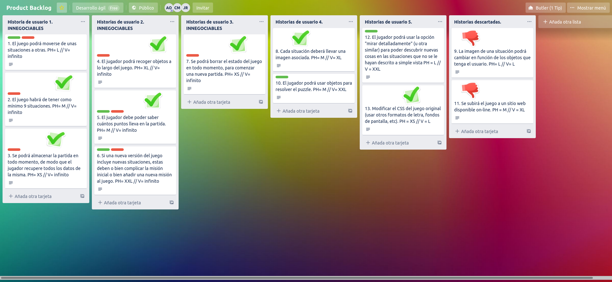

Enlace al tablero en trello: https://trello.com/b/feNAv2oH/product-backlog

### Sprint Backlog tras finalizar la reunión



Enlace al tablero en trello: https://trello.com/b/4xKIoq9U/5-el-jugador-debe-poder-saber-cu%C3%A1ntos-puntos-lleva-en-la-partida-ph-m-v-infinito



Enlace al tablero en trello: https://trello.com/b/XLuLl4TM/6-si-una-nueva-versi%C3%B3n-del-juego-incluye-nuevas-situaciones-estas-deben-o-bien-complicar-la-misi%C3%B3n-inicial-o-bien-a%C3%B1adir-una-nue



Enlace al tablero en trello: https://trello.com/b/cfin4peA/10-el-jugador-podr%C3%A1-usar-objetos-para-resolver-el-puzzle-ph-m-v-xxl

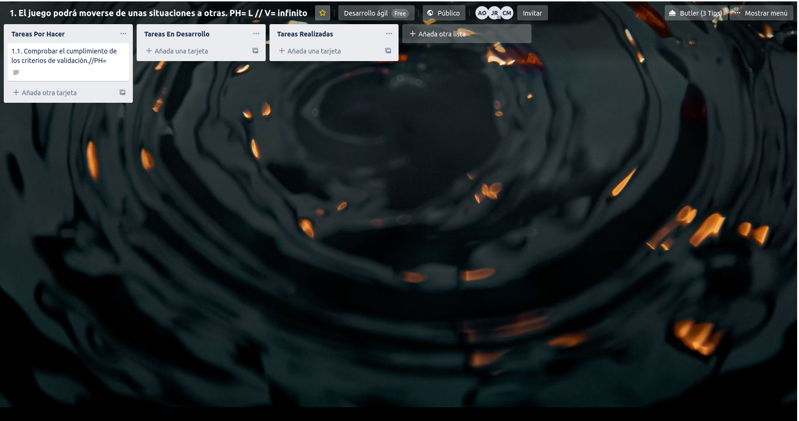

Enlace al tablero en trello: https://trello.com/b/B0HREiGg/1-el-juego-podr%C3%A1-moverse-de-unas-situaciones-a-otras-ph-l-v-infinito

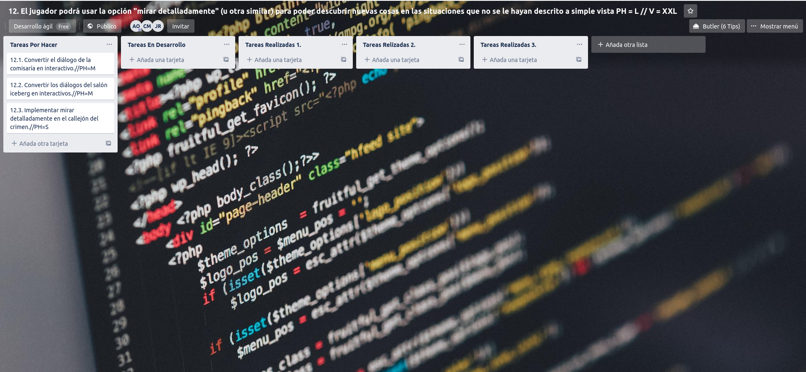

Enlace al tablero en trello: https://trello.com/b/6AUpPdV9/12-el-jugador-podr%C3%A1-usar-la-opci%C3%B3n-mirar-detalladamente-u-otra-similar-para-poder-descubrir-nuevas-cosas-en-las-situaciones-que

_Nota: Para asignar los puntos de historia a las tareas en las que hemos descompuesto las historias de usuario 1 y 12 hemos utilizado la aplicación Poker Planner de la plataforma Slack._

## Sprint Review

### ¿Qué funcionalidades se han “implementado” y cuáles no?

Hemos implementado todas las funcionalidades que nos propusimos al inicio del sprint y al relizar la Product Backlog Refinement.

### ¿Se ha revisado product backlog y estimaciones de PH y valor?

Se han completado todas las historias de usuario, por lo que se a falta del sprint de las métricas se da por finalizado satisfactoriamente el proyecto.

### Con respecto al Equipo de programación: ¿qué ha ido bien, qué problemas surgieron y qué soluciones dimos?

Tuvimos un problema a la hora de crear variables invisibles al jugador que nos permitieran controlar por qué situaciones se desplazaba el jugador e indicar que los puzzles estaban resueltos, ya que en el tutorial de undum se indicaba que tenían que ir dentro de una estructura llamada 'pool'.

Solventamos este problema consultando al experto 'Victorcillo' Rivas, quien nos recomendó que usaramos las variables de javascript, ya que estas son invisibles de por sí para el usuario.

Dada la dificultad de las tareas relacionadas con la implementación de los puzzles Jesús y Cristian no consiguieron implementar el código de forma correcta, por lo que decidimos en conjunto que yo me encargaría de realizar los puzzles mientras ellos se dedicaran a la realización de otras tareas más mecánicas de realizar. Aún así, Cristian consiguió sacar una de las tareas con mi ayuda.

Por lo demás, no han surgido más problemas excepto los ensayos y errores a la hora de ponernos a programar. 


### Demostración del incremento

Se han realizado las pertinentes pruebas de ejecución para comprobar que todo funcione, obteniendo resultados satisfactorios en las mismas. 

Queda en manos del cliente ejecutar el producto para que pueda validar la demostración del mismo.

### ¿Por dónde seguir?

Todas las historias de usuario se han completado, por lo que el proyecto se da por concluido.

No hemos tenido en cuenta la práctica que queda por hacer sobre las métricas.

### ¿Qué es lo siguiente que aporta más valor al producto?

Todas las historias de usuario se han completado, por lo que en principio no hay nada más que añada valor al producto a excepción de corregir los posibles bugs que vayan surgiendo a lo largo de la vida del producto.

### Estado del Product Backlog al final del Sprint

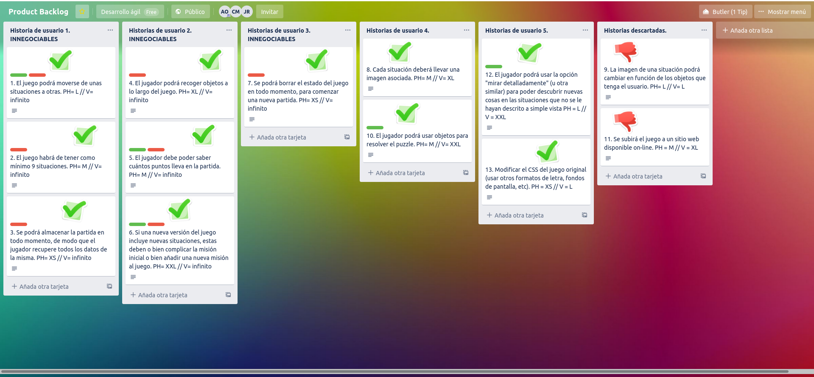

Enlace al tablero en trello: https://trello.com/b/feNAv2oH/product-backlog

### Estado del Sprint Backlog al final del Sprint



Enlace al tablero en trello: https://trello.com/b/4xKIoq9U/5-el-jugador-debe-poder-saber-cu%C3%A1ntos-puntos-lleva-en-la-partida-ph-m-v-infinito

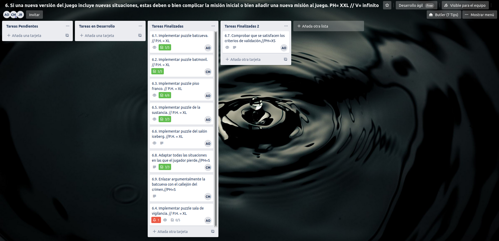

Enlace al tablero en trello: https://trello.com/b/XLuLl4TM/6-si-una-nueva-versi%C3%B3n-del-juego-incluye-nuevas-situaciones-estas-deben-o-bien-complicar-la-misi%C3%B3n-inicial-o-bien-a%C3%B1adir-una-nue

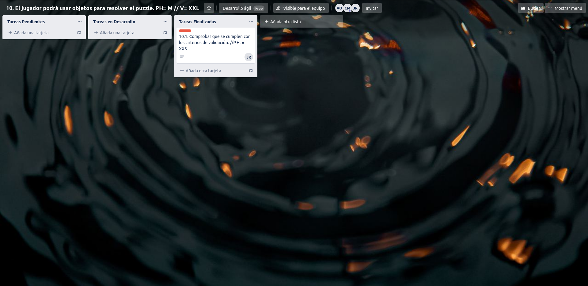

Enlace al tablero en trello: https://trello.com/b/cfin4peA/10-el-jugador-podr%C3%A1-usar-objetos-para-resolver-el-puzzle-ph-m-v-xxl

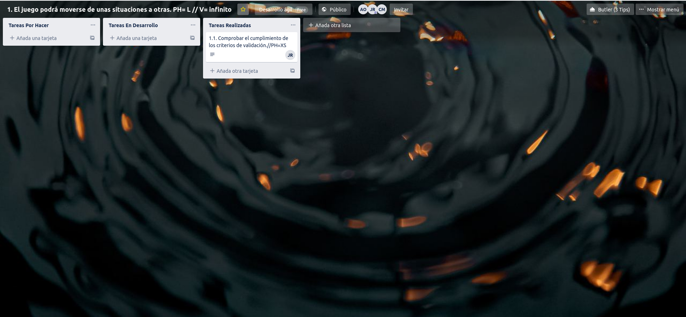

Enlace al tablero en trello: https://trello.com/b/B0HREiGg/1-el-juego-podr%C3%A1-moverse-de-unas-situaciones-a-otras-ph-l-v-infinito

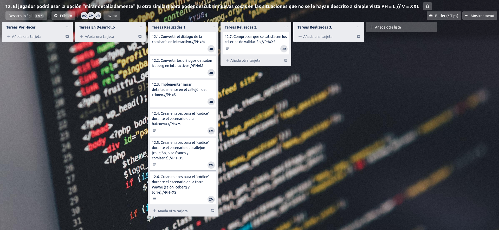

Enlace al tablero en trello: https://trello.com/b/6AUpPdV9/12-el-jugador-podr%C3%A1-usar-la-opci%C3%B3n-mirar-detalladamente-u-otra-similar-para-poder-descubrir-nuevas-cosas-en-las-situaciones-que


## Sprint Retrospective

### Inspección (personas, relaciones, procesos y herramientas)

Hemos utilizado **Skype** para hacer llamadas grupales y realizar todas las reuniones. A día de hoy seguimos utilizando esta herramienta.

Para comunicarnos día a día usamos **WhatsApp** y a través de este medio concertamos las reuniones, daily scrums e informamos de algún posible problema puntual al resto del grupo.

Usamos **Slack** para recibir notificaciones de los commits y usar **póker planner**.

### ¿Qué ha ido bien?¿Cómo mejorar?

Dentro de las limitaciones del estado de alerta sanitaria, no hemos tenido ningún problema adicional a los generados por la sobrecarga de trabajo que hemos experimentado debido a las tareas que debíamos realizar en otras asignaturas de la carrera.

Dado que este problema es un imponderable y que está fuera de nuestro control no hemos podido implementar ninguna mejora en el sistema de trabajo que nos permita solventar esta circunstancia, más allá de cubrirnos las espaldas cuando alguno de nosotros hemos tenido falta de tiempo.

### Plan para implementar mejoras (adaptación)

Dado que el sistema de trabajo no ha generado ningún problema, que nos ha funcionado a la hora de trabajar y que hemos llegado al final del proyecto, creemos que no es necesario implementar ningún plan de mejora.

## Dailys Scrums

La primera semana pudimos realizar dailys scrums tres días de los cuatro posibles y la segunda semana realizamos dailys scrums dos días de los tres posibles.

El motivo por el que no se realizaron las pocas dailys scrums que arriba se mencionan ha sido porque teníamos entregas de otras asignaturas esos días y nos fue imposible concretar una hora en la que todos estuvieramos disponibles. 


---

# MÉTRICAS

## Proyecto general

_Enlace a la hoja de cálculo en drive:_ https://docs.google.com/spreadsheets/d/14eotL6F7Iat1A5AfQ0TH5OHRiiYgN-zo9Y3TdI-BgUc/edit?usp=sharing

### Tabla puntos de historia

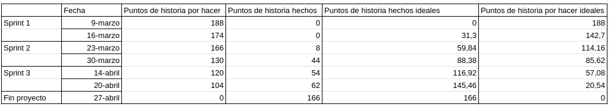

### Gráfico Burn-Up

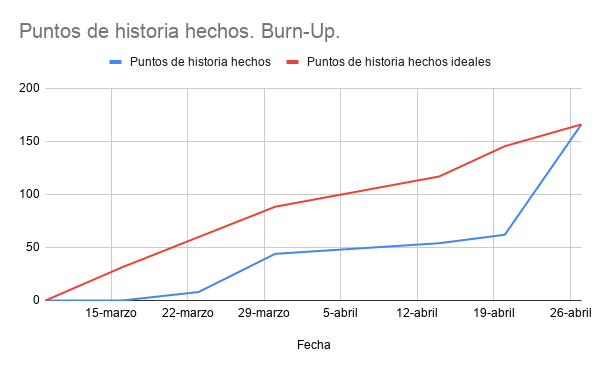

### Gráfico Burn-Down

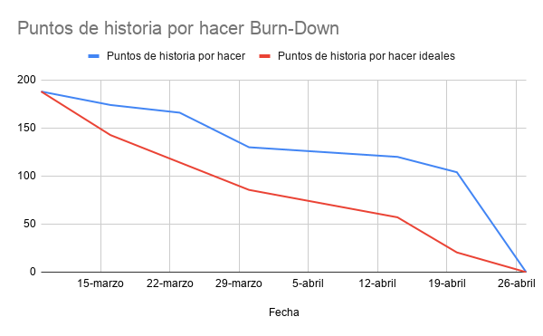

### Tabla valor

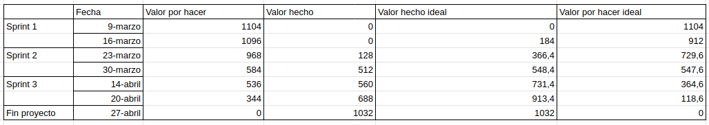

### Gráfico Burn-Up

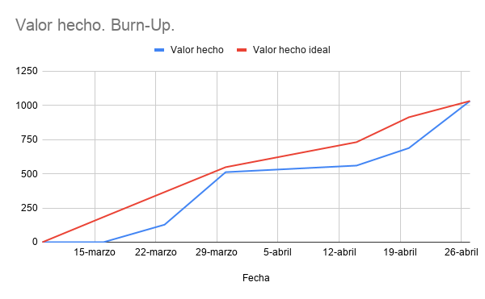

### Gráfico Burn-Down

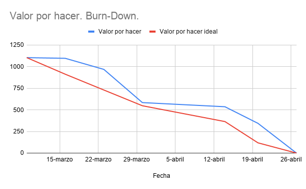

## Sprint 1

_Enlace a la hoja de cálculo en drive:_ https://docs.google.com/spreadsheets/d/12DlFbLfSr76ErHb6g-dyP2Xoev-XcR2RBK_mmOWWE6I/edit?usp=sharing

### Tabla puntos de historia

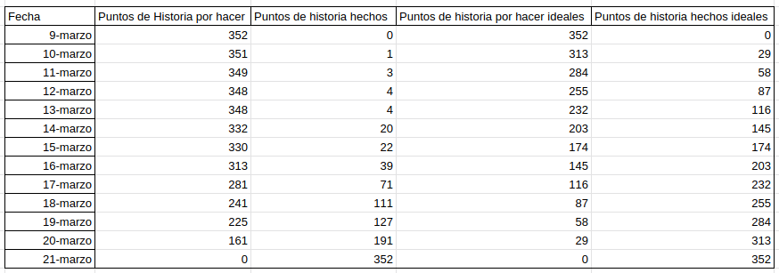

### Gráfico Burn-Up

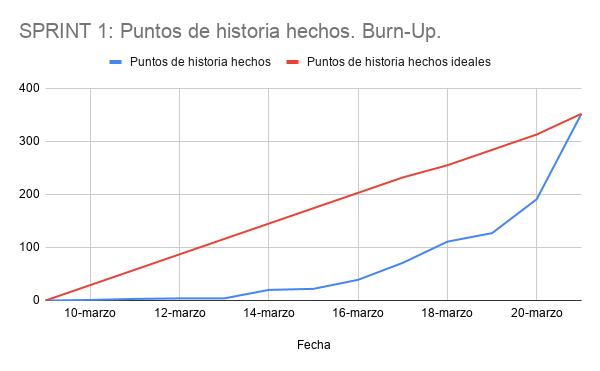

### Gráfico Burn-Down

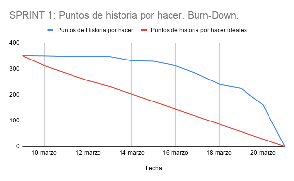

## Sprint 2

_Enlace a la hoja de cálculo en drive:_ https://docs.google.com/spreadsheets/d/1nA3hkAT_YJjf5Xt4JQiYAY_vG-mUcDPmOgnkCkBNquw/edit?usp=sharing

### Tabla puntos de historia

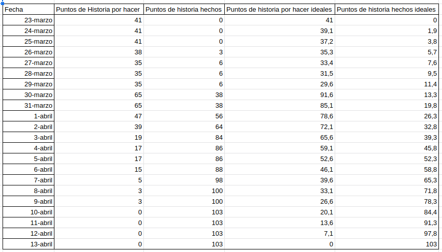

### Gráfico Burn-Up

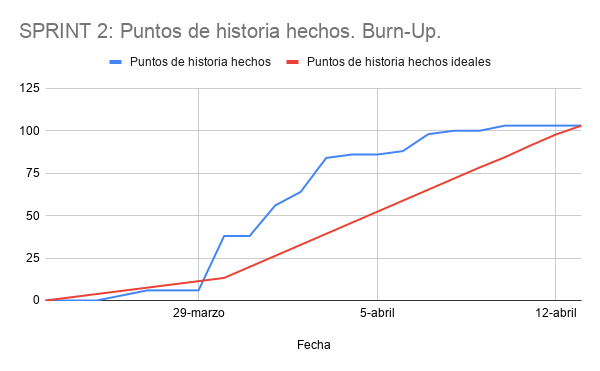

### Gráfico Burn-Down

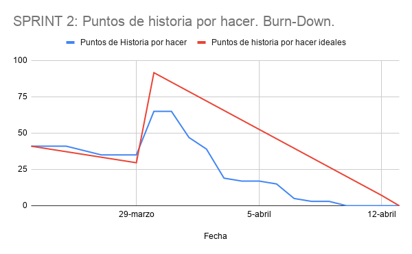

## Sprint 3

_Enlace a la hoja de cálculo en drive:_ https://docs.google.com/spreadsheets/d/1ycIBWu7hV8jKUtyqz4vageojeX5QWicxcIW0H-Gk2ow/edit?usp=sharing

### Tabla puntos de historia

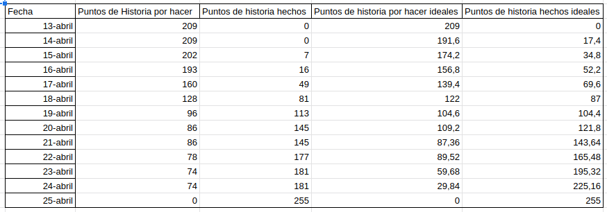

### Gráfico Burn-Up

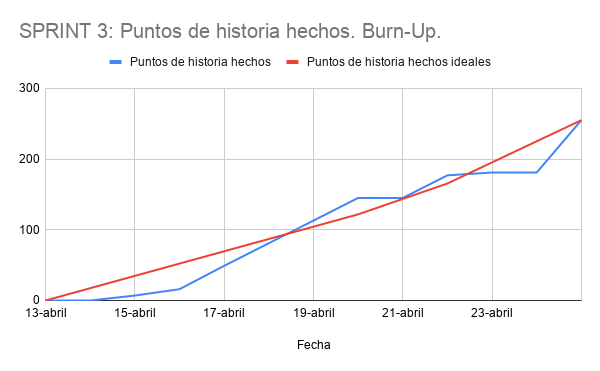

### Gráfico Burn-Down

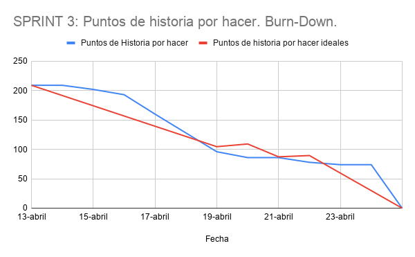

## Historia de usuario 1

_Enlace a la hoja de cálculo en drive:_ https://docs.google.com/spreadsheets/d/1g9vtQaJUjHzHXt1PSwuX5GBGdN6HyDs3Ym0_XI8Vm8E/edit?usp=sharing

### Tabla puntos de historia

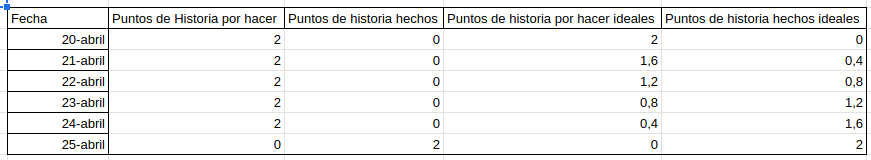

### Gráfico Burn-Up

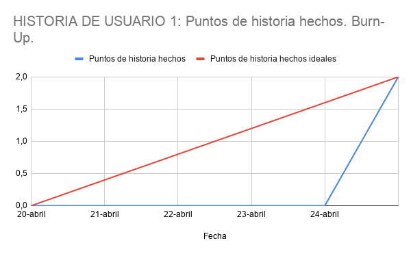

### Gráfico Burn-Down

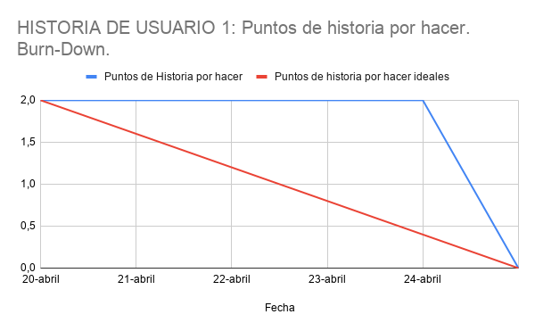

## Historia de usuario 2

_Enlace a la hoja de cálculo en drive:_ 
https://docs.google.com/spreadsheets/d/1QR7TsZpJdSXM7HfuJkJvzJABjXX8mT87s5S50tCO0eA/edit#gid=0

### Tabla puntos de historia



### Gráfico Burn-Up



### Gráfico Burn-Down



## Historia de usuario 3

_Enlace a la hoja de cálculo en drive:_ 
https://docs.google.com/spreadsheets/d/1GTS_T0DbUzQkfrCzDpNXQDUuM1fuJoQ6LxMeGSLs7P0/edit#gid=0

### Tabla puntos de historia



### Gráfico Burn-Up



### Gráfico Burn-Down



## Historia de usuario 4

_Enlace a la hoja de cálculo en drive:_ 
https://docs.google.com/spreadsheets/d/1o6saL-cBgWx3ah1FP8Y1rbaXGXPERP70HjYsBGqVcW8/edit#gid=0

### Tabla puntos de historia



### Gráfico Burn-Up



### Gráfico Burn-Down



## Historia de usuario 5

_Enlace a la hoja de cálculo en drive:_ 
https://docs.google.com/spreadsheets/d/1QALwa51DLz1gmfYCU2zvzPbYQl_BrR4E3JCXvr0OjnA/edit#gid=0

### Tabla puntos de historia



### Gráfico Burn-Up



### Gráfico Burn-Down



## Historia de usuario 6

_Enlace a la hoja de cálculo en drive:_ 
https://docs.google.com/spreadsheets/d/1vdoN_5pW717QMbOUVlJrHhu1J_EOO7PKkhqF_dq3pvw/edit#gid=0

### Tabla puntos de historia



### Gráfico Burn-Up



### Gráfico Burn-Down



## Conclusiones finales

---

